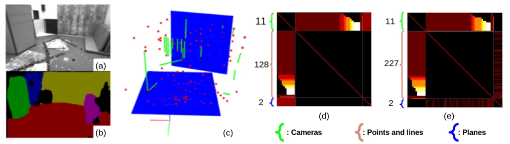

# Co-Planar Parametrization

Co-Planar Parametrization (CP-Param) provides a  new parametrization for co-planar points and lines, which leverages specific geometric constraints to improve camera pose optimization in terms of both efficiency and accuracy.   Based on the parametrization, we implement a framework for Stereo SLAM and  Visual-Inertial Odometry. 



We provide examples to run CP-Param in the [EuRoC dataset](http://projects.asl.ethz.ch/datasets/doku.php?id=kmavvisualinertialdatasets) using stereo or VIO. Considering that not every developer has a GPU for plane instance segmentation, we also provide our segmentation results of the EuRoc dataset. Please cite it if you use the repo in academic work.

```
@article{Li2020cpparam,
  author = {Li, Xin and Li, Yanyan and \"{O}rnek, Evin Pınar and Lin , Jinlong and Tombari, Federico},
  title = {Co-Planar Parametrization for Stereo-SLAM and Visual-Inertial Odometry},
  journal = {IEEE Robotics and Automation Letters},
  year = {2020},
  publisher={IEEE}
 }
```

# 1. License 

Structure-SLAM(PL) is released under a [GPLv3 license](https://github.com/raulmur/StructureSLAM/blob/master/License-gpl.txt). For a closed-source version of CP-Param for commercial purposes, please contact me lixin97@pku.edu.cn

# 2. Prerequisites

We have tested the library in **Ubuntu** **16.04**, but it should be easy to compile in other platforms. A powerful computer (e.g. i7) will ensure real-time performance and provide more stable and accurate results.

## C++11 or C++0x Compiler

We use the new thread and chrono functionalities of C++11.

## Pangolin

We use [Pangolin](https://github.com/stevenlovegrove/Pangolin) for visualization and user interface. Dowload and install instructions can be found at: https://github.com/stevenlovegrove/Pangolin.

## OpenCV

We use [OpenCV](http://opencv.org) to manipulate images and features. Dowload and install instructions can be found at: http://opencv.org. **Required at least 2.4.3. Tested with OpenCV 3.4.0**.

## Eigen3

Required by g2o (see below). Download and install instructions can be found at: http://eigen.tuxfamily.org. **Required at least 3.1.0**.

## DBoW2 and g2o (Included in Thirdparty folder)

We use modified versions of the [DBoW2](https://github.com/dorian3d/DBoW2) library to perform place recognition and [g2o](https://github.com/RainerKuemmerle/g2o) library to perform non-linear optimizations. Both modified libraries (which are BSD) are included in the *Thirdparty* folder.

# 3. Test CP-Param

## Download and build


## Run on ICL NUIM dataset


# Acknowledgements

 

